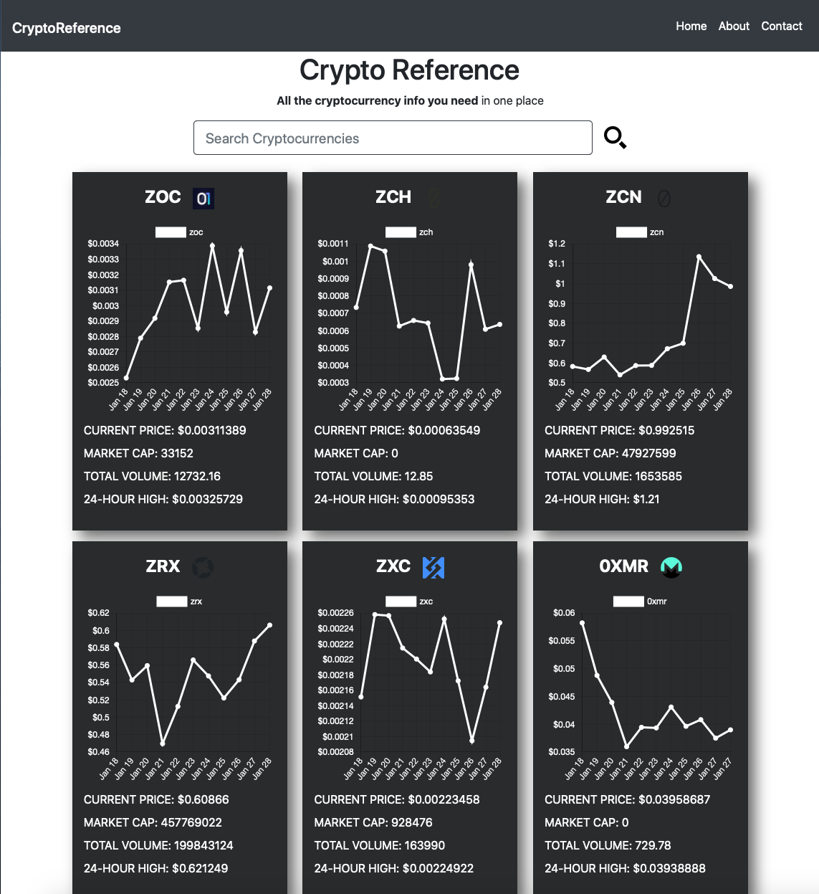
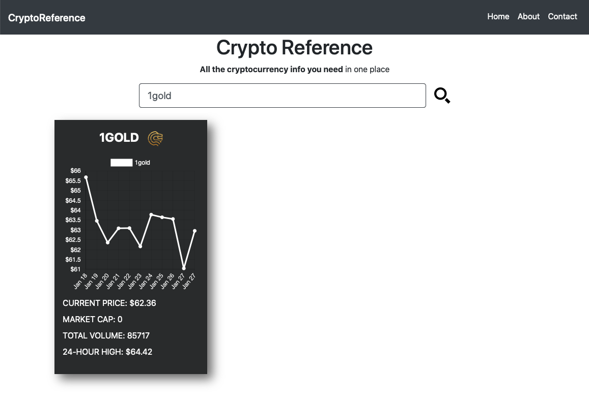

# CryptoReference

## Web app for viewing organized cryptocurrency data

### Vanilla JS with [Coingecko API](https://www.coingecko.com/en/api) for cryptocurrency data and [ChartJS](https://www.chartjs.org) for graphs

## [Try it here!](https://cryptoreference.netlify.app/)

